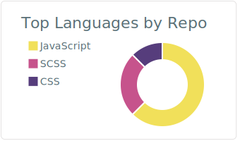

Then you can use everything in profile-summary-card-output folder
| :warning: | If your workflow does not generate all cards in output folder, then you need to use [Personal access token](https://docs.github.com/en/actions/configuring-and-managing-workflows/creating-and-storing-encrypted-secrets) instead of GITHUB_TOKEN in workflow. |
| :-------: | :------------------------------------------------------------------------------------------------------------------------------------------------------------------------------------------------------------------------------------------------ |

